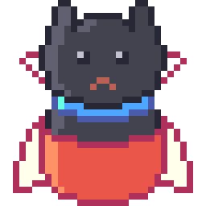

# Socky

A Minecraft mod that adds recipes and models for cute stuffed animals.

Socky is a **Minecraft mod** that adds decorative stuffed animals to the game.
It adds the following items with associated recipes and models:
- Smol Body
- Smol Cape
- Smol Pants
- Smol Scarf
- Socky
- Blocky
- Ambrose

It is built on the Fabric mod loader and is available for the following versions of Minecraft Java Edition:
- `1.20.1`
- `1.21.1`
- `1.21.4`–`1.21.11`